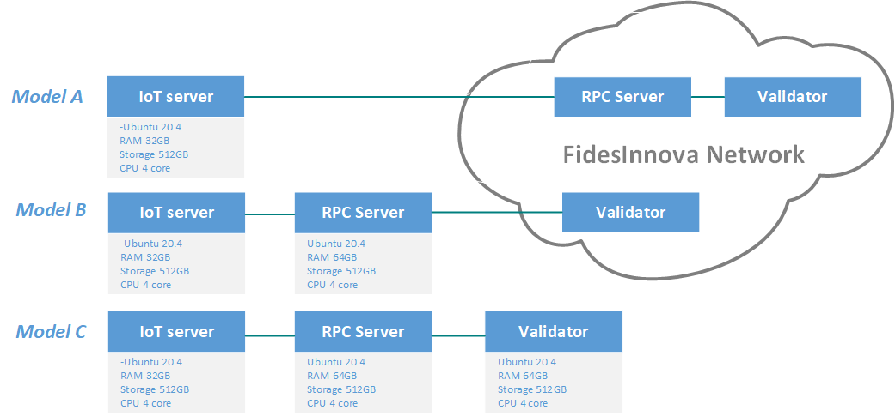

[circleci-image]: https://img.shields.io/circleci/build/github/nestjs/nest/master?token=abc123def456
[circleci-url]: https://circleci.com/gh/nestjs/nest

  
A decentralized platform for trusted Internet-of-Things

    

# FidesInnova: Redefining Security and Trust for the IoT Future
FidesInnova sets a new benchmark for security and trust in the evolving landscape of IoT. Our platform leverages cutting-edge verifiable computing technologies, including zero-knowledge proofs (ZKP) and blockchain, to deliver unparalleled reliability and transparency.
 
## Key Features
<strong>zk-IoT Platform:</strong> At the forefront of our offering, zk-IoT integrates ZKP technology into the IoT domain, redefining standards for decentralized, reliable IoT systems. It ensures the accuracy of firmware execution and facilitates seamless, trustworthy communication between IoT devices.

<strong>Functional-Hiding Commitment Cryptography:</strong> Central to FidesInnova’s architecture is our advanced functional-hiding commitment cryptography algorithm, which underpins the security and integrity of data handling and processing.

<strong>Service Contracts:</strong> Introducing a groundbreaking feature, Service Contracts are customizable, JavaScript-based mini-programs that empower users to effortlessly manage and monetize IoT data. Our Service Market enhances this experience by providing a diverse range of pre-written contracts, expanding the functionalities of IoT devices with ease.

## Ecosystem Components
<strong> IoT Node:</strong> A software package equipped with ZKP-enabled JavaScript execution, acting as the core component for secure and authentic service contract execution. 

<strong> Fides Mobile App:</strong> Available on major app stores, this app provides users with comprehensive control over their IoT devices. 

<strong> Fides Web App:</strong> Designed for service creation and data monetization, it complements the mobile app by offering a robust platform for managing and expanding IoT capabilities. 

FidesInnova isn’t just a platform; it’s a holistic ecosystem that empowers users and enhances their IoT experience through innovative technology and seamless integration.
#### To access the private repositories, please email info@fidesinnova.io

# FidesInnova Deployment Models

Welcome to the FidesInnova deployment repository! This guide will help you choose the right deployment model for your needs, whether you are setting up a simple IoT server or a fully decentralized system with RPC and Validator services.
We provide three deployment models, each designed for different levels of complexity and resource requirements. Choose the model that best fits your project.

#### Model A: Single IoT Server Deployment
Model A is a simple setup with only an IoT Server connecting to the FidesInnova Network. This setup is ideal for lightweight applications where validation and RPC services are handled by the FidesInnova Network.

- **Repository**: Connect the IoT server to the backend web application available in the [FidesInnova IoT Node Backend Web App repository](https://github.com/FidesInnova/iot_node_backend_web_app).

#### Model B: IoT Server with RPC Server
Model B introduces an RPC Server alongside the IoT Server. The RPC Server acts as an interface to the FidesInnova Network, providing more control over network requests and data interaction.

- **Repository**: To deploy the RPC Server, use the [FidesInnova IoT Node EVM repository](https://github.com/FidesInnova/iot_node_evm) and follow the instructions for configuring the **2 - Second Node** section.

#### Model C: Full IoT, RPC, and Validator Setup
Model C is the most comprehensive deployment model, including an IoT Server, RPC Server, and a Validator node. This setup is suitable for fully decentralized systems requiring local data validation and advanced network interaction.

- **Repository**: Refer to the [FidesInnova IoT Node EVM repository](https://github.com/FidesInnova/iot_node_evm) and follow the instructions for configuring the **1 - Main Node (Miner)** section.

